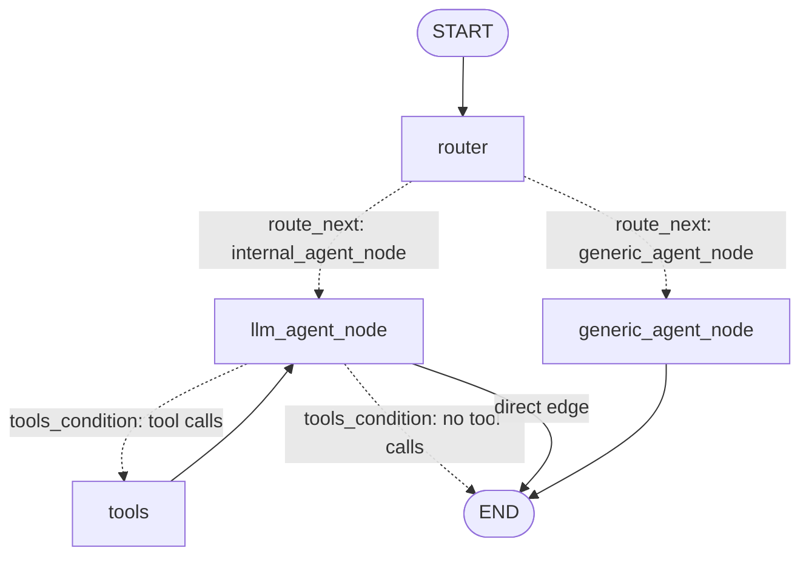

# Langgraph Agentic AI framework

This is FastAPI based application with exposed http endpoints to interact with agent.
It is using mainly Azure Cloud services setup like Azure OpenAI endpoints for LLM, Azure AI Search for vector database, Azure  Flexible server for MySQL for relational database. You can configure it with other cloud providers too if necessary.
It contains MCP servers and MCP clients in the same application. Few dummy MCP servers is there to start with the project initialization which is connected to MCP client. You can download the project and change the server logic according to your needs.

### Future Improvements

```
  1. Add support for ChromaDB vector database and SQLite3 relational database.
  2. Add support for AWS setup with Amazon OpenSearch Service, Amazon Bedrock and Amazon RDS for MySQL
```


### StartUp command

```Linux/MacOS terminal
After activating virtual environment

pip3 install -r requirements.txt

uvicorn app.main:app --host 127.0.0.1  --port 8000 --reload

``` 

### Http Urls

``` 
Swagger Docs - [Base-url]/docs

FastAPI - [Base-url]/

Agents - [Base-url]/agent/invoke

```

### .env file setup - for local development
```
OPENAI_API_KEY= open ai api key
AZURE_OPENAI_ENDPOINT= Azure Foundry project url
AZURE_OPENAI_API_VERSION= Azure OpenAI deployment version
AZURE_OPENAI_DEPLOYMENT= Azure OpenAI deployment name
AZURE_OPENAI_MODEL= Azure openai model name

AZURE_SEARCH_SERVICE_NAME= Azure AI Search service
AZURE_SEARCH_API_KEY= Azure AI Search api key


DB_SERVER_NAME= Azure Db server name
DB_NAME= Azure DB name
DB_USERNAME= Azure DB username
DB_PASSKEY= Azure DB password
```


### Directory Structure

```
├── DigiCertGlobalRootCA.crt.pem - for Azure MySQL Flexible server DB interaction
├── README.md
├── app  -----------------------------------[main application folder for the whole application]
│   ├── __init__.py
│   ├── main.py ----------------------------[entrypoint of the fastapi application]
│   ├── mcp_client  ------------------------[folder for configuring mcp clients]
│   │   ├── __init__.py
│   │   ├── agent.py  -----------------------[agent api and agent setting config file]
│   │   ├── graph.py  -----------------------[file for langgraph agent workflow]
│   │   ├── models.py   ---------------------[file for creating Pydantic Models and BaseModels]
│   │   └── serverconfig.py -----------------[configuration file for all mcp tools exposed for mcp clients]
│   ├── mcp_server --------------------------[folder for configuring mcp tools/functions and services]
│   │   ├── __init__.py
│   │   ├── ai_search_document_tool.py -------[azure AI Search mcp tool]
│   │   ├── create_material_tool.py  ---------[Create Material record in DB mcp tool] -Dummy
│   │   └── taskcreate_tool.py   -------------[Create Task record in DB mcp tool] -Dummy
│   └── services
│       ├── __init__.py
│       ├── azure_ai_search_service.py ---------[Azure AI Search service connection manager]
│       ├── db_service.py  ---------------------[Azure MySQL Flexible Server DB conn manager]
│       └── llm_service.py ---------------------[Azure OpenAI LLM connection manager service]
├── config.py ----------------------------------[config file env vars]
├── requirements.txt
├── tests -------------------------------------------[unit test cases folder]
```


## Agent workflow graph

